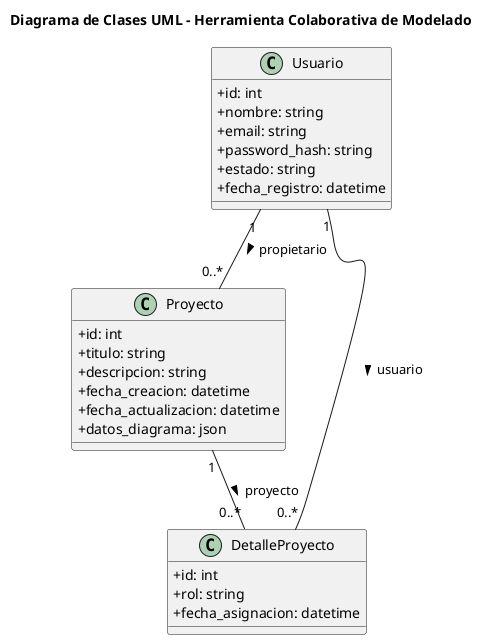
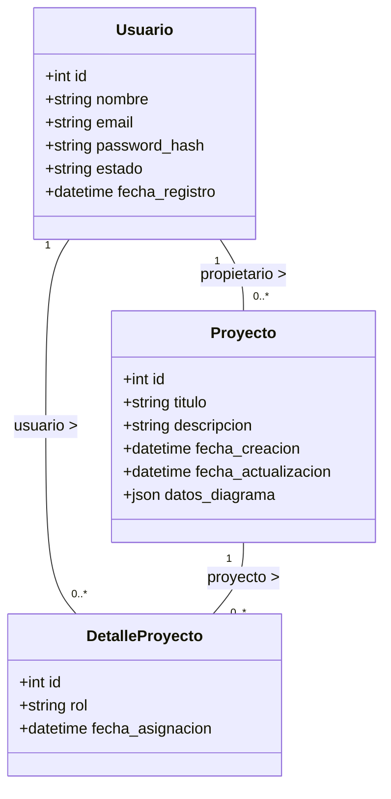

# Diagrama de Clases Definitivo del Sistema

Este es el modelo oficial de clases y base de datos definido para el sistema:

---

## 1. Código PlantUML (`.puml`)

---

## 2. Código Mermaid

---

## 3. Justificación del Modelo para el Parcial

1. **`Usuario`**: Gestiona la autenticación, seguridad y datos de los miembros del sistema.
2. **`Proyecto`**: Contiene la información del proyecto y almacena el estado visual completo del lienzo UML en el campo `datos_diagrama` (formato JSON de clases, atributos, métodos, coordenadas y flechas UML).
3. **`DetalleProyecto`**: Clase de asociación que resuelve la relación Muchos a Muchos entre `Usuario` y `Proyecto`, guardando el `rol` de cada colaborador (ej. editor, lector) y la fecha en que fue invitado.
